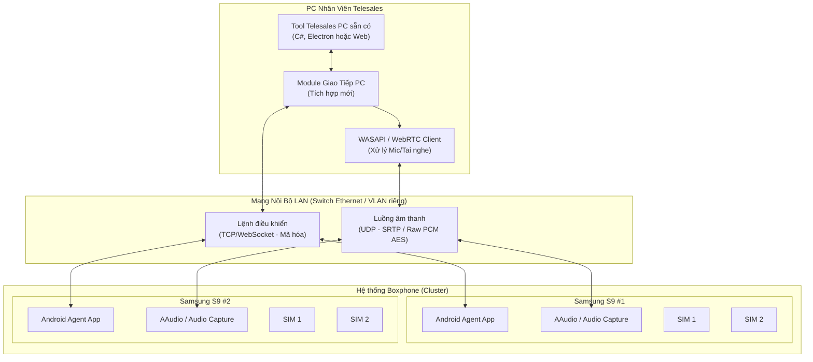

# TÀI LIỆU YÊU CẦU NGHIỆP VỤ (BUSINESS REQUIREMENT DOCUMENT - BRD)
## DỰ ÁN: KẾT NỐI TOOL TELESALES TRÊN PC VỚI PHẦN CỨNG BOXPHONE (SAMSUNG S9 2 SIM)

| Thông tin tài liệu | Chi tiết |
| :--- | :--- |
| **Tên dự án** | Tích hợp hệ thống Telesales PC với Phần cứng Boxphone qua LAN |
| **Phiên bản** | V1.1 (Cập nhật và bổ sung đầy đủ) |
| **Ngày cập nhật** | 16/06/2026 |
| **Trạng thái** | Dự thảo (Draft) |
| **Người thực hiện** | Business Analyst & AI Assistant |

---

## 1. CÁC BÊN LIÊN QUAN & TRÁCH NHIỆM (STAKEHOLDERS & RACI)

Để dự án triển khai thành công, vai trò và trách nhiệm của các bên liên quan được xác định theo ma trận RACI như sau:

| Bên liên quan | Vai trò chính | Trách nhiệm (RACI) |
| :--- | :--- | :--- |
| **Product Owner / Quản lý dự án của Khách hàng** | Định hướng nghiệp vụ, duyệt yêu cầu và nghiệm thu hệ thống | **A** (Accountable - Chịu trách nhiệm tối cao) |
| **Business Analyst (BA)** | Khảo sát yêu cầu, làm rõ nghiệp vụ và soạn thảo BRD | **R** (Responsible - Thực hiện), **C** (Consulted) |
| **Đội phát triển Tool PC (Đối tác hoặc Khách hàng)** | Hỗ trợ tích hợp Module giao tiếp vào Tool Telesales sẵn có trên PC | **R** (Responsible), **C** (Consulted) |
| **Đội phát triển Giải pháp kết nối (Chúng tôi)** | Phát triển Module giao tiếp PC, Agent App trên S9, cấu hình truyền nhận âm thanh | **R** (Responsible - Thực hiện chính) |
| **Đội hạ tầng mạng & hệ thống của Khách hàng** | Cấu hình LAN, Switch, Router, cấp phát IP, VLAN, QoS | **R** (Responsible), **I** (Informed) |
| **Nhân viên Telesales (End User)** | Tham gia thử nghiệm UAT, phản hồi chất lượng cuộc gọi | **C** (Consulted), **I** (Informed) |

*Ghi chú:*
*   **R** (Responsible): Người trực tiếp thực hiện công việc.
*   **A** (Accountable): Người chịu trách nhiệm phê duyệt cuối cùng.
*   **C** (Consulted): Người được tham vấn ý kiến.
*   **I** (Informed): Người được nhận thông tin thông báo.

---

## 2. TỔNG QUAN DỰ ÁN & HIỆN TRẠNG

### 2.1. Bối cảnh dự án
Doanh nghiệp hiện đã vận hành ổn định phần mềm (Tool) quản lý thông tin khách hàng và danh sách gọi ra (Telesales) trên máy tính (PC). Tuy nhiên, phần mềm này đang chạy độc lập và nhân viên telesales phải sử dụng điện thoại ngoài để gọi điện cho khách hàng một cách thủ công.
Để tối ưu chi phí cước viễn thông thông qua các gói cước SIM di động thương mại giá rẻ, doanh nghiệp lựa chọn giải pháp sử dụng **Boxphone** (thiết bị tích hợp cụm điện thoại Samsung S9, mỗi điện thoại hỗ trợ 2 SIM vật lý).
Dự án được triển khai nhằm tích hợp trực tiếp Tool PC sẵn có này với phần cứng Boxphone qua kết nối mạng nội bộ (LAN).

### 2.2. Hiện trạng & Vấn đề cần giải quyết
*   **Đã có:** Phần mềm Telesales trên PC (quản lý lead, hiển thị thông tin cuộc gọi, nút bấm gọi/gác máy, ghi chú sau cuộc gọi).
*   **Chưa có:** Cơ chế giao tiếp (lệnh điều khiển và luồng âm thanh - audio stream) giữa PC và cụm điện thoại Android trong Boxphone.
*   **Vấn đề cần giải quyết:** Xây dựng module tích hợp vào phần mềm PC sẵn có và ứng dụng Android Agent trên cụm điện thoại Boxphone, đảm bảo hai bên trao đổi lệnh điều khiển cuộc gọi và luồng âm thanh hai chiều thời gian thực qua mạng LAN với độ trễ tối thiểu.

### 2.3. Mục tiêu dự án
Xây dựng giải pháp kết nối, truyền tải âm thanh và điều khiển cuộc gọi hai chiều giữa **Tool Telesales trên PC** và **Phần cứng Boxphone** thông qua mạng nội bộ (LAN). Hệ thống phải đảm bảo các chỉ số kỹ thuật khắt khe về hiệu năng, độ trễ và chất lượng cuộc gọi để nhân viên telesales có thể đàm thoại trực tiếp trên máy tính thông qua tai nghe (headset) giống như hệ thống VoIP/IP PBX chuyên nghiệp.

---

## 3. PHẠM VI DỰ ÁN (SCOPE OF WORK)

### 3.1. Thuộc phạm vi (In-Scope)
*   Phát triển **Module giao tiếp trên PC** dưới dạng thư viện tích hợp hoặc API/WebSocket Client để tích hợp trực tiếp vào Tool Telesales hiện tại nhằm truyền nhận lệnh và luồng âm thanh.
*   Phát triển **Ứng dụng nền (Agent App)** chạy trên các máy Samsung S9 (Boxphone) để nhận lệnh điều khiển cuộc gọi (quay số, bắt máy, gác máy, chọn SIM) và xử lý luồng âm thanh đầu vào/đầu ra của cuộc gọi SIM.
*   Thiết lập giao thức truyền tải âm thanh thời gian thực (Real-time Audio Streaming) qua mạng LAN đảm bảo độ trễ truyền dẫn nội bộ siêu thấp (< 50ms).
*   Xây dựng cơ chế cấu hình và ánh xạ (Mapping) giữa tài khoản Telesales trên PC và các SIM/Điện thoại trong hệ thống Boxphone.
*   Tích hợp các kịch bản phụ trợ nghiệp vụ: Giữ cuộc gọi (Hold), Chuyển cuộc gọi (Transfer), Ghi âm (Recording), và Quản lý sức khỏe thiết bị Boxphone.

### 3.2. Ngoài phạm vi (Out-of-Scope)
*   Nâng cấp các tính năng quản lý khách hàng (CRM) đã có sẵn trên Tool PC.
*   Cung cấp phần cứng Boxphone (Boxphone Samsung S9 là thiết bị có sẵn từ khách hàng).
*   Giải quyết các vấn đề về sóng viễn thông yếu của nhà mạng di động tại khu vực đặt Boxphone.

---

## 4. YÊU CẦU NGHIỆP VỤ CHI TIẾT (BUSINESS REQUIREMENTS)

Hệ thống cần đáp ứng các kịch bản nghiệp vụ (Use Cases) sau:

### 4.1. Quản lý và Điều khiển Cuộc gọi (Call Control)
*   **UC-01: Thực hiện cuộc gọi đi (Outbound Call)**
    *   Telesales nhấn nút "Gọi" trên Tool PC.
    *   Hệ thống tự động chọn SIM còn trống trên Boxphone được chỉ định và thực hiện quay số.
    *   Hiển thị trạng thái cuộc gọi trên màn hình PC: *Đang quay số -> Đang đổ chuông -> Đã kết nối (Đàm thoại) -> Kết thúc*.
*   **UC-02: Nhận cuộc gọi đến (Inbound Call)**
    *   Khi có cuộc gọi vào SIM trên Boxphone, hệ thống định tuyến tín hiệu về đúng PC của nhân viên được phân quyền.
    *   Hiển thị thông báo cuộc gọi đến trên PC kèm nút "Bắt máy" hoặc "Từ chối".
*   **UC-03: Gác máy/Kết thúc cuộc gọi (Hang up)**
    *   Nhân viên nhấn nút kết thúc trên PC, lệnh được truyền tới Boxphone để ngắt kết nối cuộc gọi di động ngay lập tức.
*   **UC-04: Lựa chọn và Chuyển đổi SIM**
    *   Hệ thống hỗ trợ cấu hình chọn SIM để gọi: chọn SIM 1 hoặc SIM 2 của Samsung S9.
    *   Có chế độ tự động đảo SIM (Auto-rotate SIM) để tránh spam cước hoặc tối ưu gói cước theo nhà mạng của số điện thoại đích.
*   **UC-05: Giữ cuộc gọi (Hold / Resume)**
    *   Telesales nhấn nút "Giữ cuộc gọi" trên Tool PC khi cần tra cứu thông tin.
    *   Hệ thống tạm thời ngắt luồng âm thanh hai chiều nhưng giữ kết nối cuộc gọi viễn thông. Điện thoại S9 phát nhạc chờ (tùy chọn) hoặc im lặng cho phía khách hàng.
    *   Nhấn "Tiếp tục" để khôi phục luồng đàm thoại bình thường.
*   **UC-06: Chuyển tiếp cuộc gọi (Call Transfer)**
    *   Cho phép chuyển cuộc gọi đang đàm thoại sang một số máy nhánh PC (nhân viên khác) hoặc số điện thoại bên ngoài.
*   **UC-07: Tự động quay số theo danh sách (Auto / Progressive Dialer)**
    *   Hệ thống tự động đẩy số điện thoại từ danh sách lead trên Tool PC xuống Boxphone để quay số ngay khi nhân viên kết thúc cuộc gọi trước và hoàn thành ghi chú (ACW - After Call Work).

### 4.2. Quản lý Luồng Âm thanh (Audio Streaming)
*   **UC-08: Truyền nhận âm thanh hai chiều (Duplex Audio)**
    *   Giọng nói của khách hàng (thu qua mic của điện thoại trên Boxphone từ sóng viễn thông) phải được truyền ngay lập tức về tai nghe của Telesales cắm trên PC.
    *   Giọng nói của Telesales (nói vào mic của tai nghe cắm trên PC) phải được truyền đến điện thoại trên Boxphone và phát vào luồng cuộc gọi viễn thông đến khách hàng.
*   **UC-09: Ghi âm cuộc gọi (Call Recording)**
    *   Tự động ghi âm cuộc gọi hai chiều khi bắt đầu kết nối đàm thoại.
    *   File ghi âm được lưu trữ tạm thời trên PC hoặc đẩy lên máy chủ lưu trữ tập trung của doanh nghiệp sau khi cuộc gọi kết thúc.

### 4.3. Quản lý và Vận hành Thiết bị (Device Management)
*   **UC-10: Giám sát trạng thái thiết bị (Device Health Monitoring)**
    *   Đo đạc và gửi trạng thái của từng máy Samsung S9 trong Boxphone về màn hình quản trị của IT/Admin:
        *   Trạng thái kết nối LAN (Ping/Latency).
        *   Trạng thái pin (Nhiệt độ, dung lượng pin để tránh cháy nổ khi cắm sạc liên tục).
        *   Cường độ sóng di động (dBm) của từng SIM.
        *   Trạng thái SIM (Hoạt động/Lỗi/Không có sóng).
*   **UC-11: Xử lý lỗi cuộc gọi (Error Handling & Call Exceptions)**
    *   Phát hiện và trả về mã lỗi cụ thể từ modem GSM của thiết bị S9 về PC để hiển thị cho Telesales:
        *   Thuê bao bận (Busy).
        *   Thuê bao không liên lạc được (Unreachable).
        *   SIM hết tiền / mất sóng (No network/No credit).
        *   Thiết bị Boxphone lỗi phần cứng.

---

## 5. YÊU CẦU KỸ THUẬT & PHI CHỨC NĂNG (TECHNICAL & NON-FUNCTIONAL REQUIREMENTS)

### 5.1. Hiệu năng & Tải đồng thời (Concurrency)
*   **Chỉ số:** Hệ thống trên mỗi máy Samsung S9 phải đáp ứng chạy ổn định **1 luồng đàm thoại active** tại một thời điểm (giới hạn vật lý của thiết bị di động).
*   Để đáp ứng nhu cầu chạy đồng thời từ **5 đến 7 luồng cuộc gọi** của doanh nghiệp, Boxphone phải tích hợp tối thiểu **5 đến 7 điện thoại Samsung S9** hoạt động song song.
*   **Giải pháp định tuyến tải:** Module PC hoặc máy chủ quản lý Boxphone phải có thuật toán phân tải thông minh (Round-robin hoặc Least-connections) để phân phối cuộc gọi từ các máy PC telesales đến những thiết bị S9 đang ở trạng thái rảnh (Idle) trong Boxphone.

### 5.2. Độ trễ cực thấp (Ultra-low Latency)

> [!IMPORTANT]
> **Lưu ý quan trọng về phạm vi đo độ trễ:**
> Chỉ số độ trễ cam kết < 50ms chỉ áp dụng cho phân đoạn truyền dẫn nội bộ mạng LAN và xử lý phần mềm của hệ thống (PC ↔ Mạng LAN ↔ Boxphone S9). Độ trễ này KHÔNG bao gồm độ trễ vật lý của nhà mạng di động viễn thông (GSM/VoLTE thường từ 30ms đến 150ms).

*   **Chỉ số độ trễ mạng nội bộ (LAN Latency):**
    *   **Chiều Downlink (Khách hàng nói -> Tai nghe Telesales):** Từ lúc micro điện thoại Samsung S9 nhận tín hiệu âm thanh đàm thoại -> Đọc và mã hóa bởi Agent App -> Truyền qua LAN -> PC nhận, giải mã và phát ra tai nghe: **< 50 ms**.
    *   **Chiều Uplink (Telesales nói -> Modem cuộc gọi S9):** Từ lúc micro tai nghe PC nhận tín hiệu -> Truyền qua LAN -> Agent App trên S9 nhận -> Ghi vào luồng đàm thoại GSM: **< 50 ms**.
*   **Gợi ý kiến trúc giải quyết độ trễ:**
    *   Tránh sử dụng các giao thức VoIP tiêu chuẩn có bộ đệm lớn (như SIP/RTP truyền thống qua WAN).
    *   Khuyến nghị sử dụng **WebRTC (UDP)** chạy hoàn toàn trong mạng LAN nội bộ hoặc **Raw UDP Socket** truyền dữ liệu âm thanh dạng thô (Raw PCM, sample rate 8kHz hoặc 16kHz, 16-bit mono) để triệt tiêu thời gian nén/mã hóa (encoding/decoding overhead) và độ trễ hàng đợi buffer.
    *   Sử dụng API âm thanh độ trễ thấp trên Android (như **AAudio** hoặc **OpenSL ES**) để đọc/ghi trực tiếp vào thiết bị phần cứng âm thanh của Samsung S9.
    *   Sử dụng API âm thanh độ trễ thấp trên Windows (như **WASAPI** ở chế độ Exclusive Mode) để giảm thiểu độ trễ xử lý của OS Windows.

### 5.3. Kết nối & Mạng (Connectivity & Networking)
*   **Hạ tầng kết nối:** Kết nối hoàn toàn qua mạng nội bộ **LAN** có dây (cáp Ethernet kết nối Boxphone và PC vào chung một Switch) hoặc mạng Wi-Fi băng tần 5GHz chuyên dụng. Khuyến nghị sử dụng cáp Ethernet để đảm bảo băng thông ổn định và giảm thiểu suy hao/nhiễu gói tin.
*   **Chất lượng dịch vụ (QoS):** Cấu hình ưu tiên băng thông (QoS) cho các gói tin truyền âm thanh (UDP) trong mạng LAN để tránh hiện tượng nghẹn mạng khi có lưu lượng truyền tải dữ liệu khác.
*   **Khả năng tự phục hồi (Resilience):** Khi kết nối LAN bị chập chờn hoặc mất kết nối tạm thời, hệ thống tự động reconnect trong vòng tối đa **1.5 giây** và khôi phục trạng thái điều khiển mà không gây treo ứng dụng PC.

### 5.4. Chất lượng Âm thanh (Audio Quality)
*   **Độ rõ:** Âm thanh rõ ràng, sắc nét, không bị méo tiếng.
*   **Không nhiễu (No static/crackling):** Tỷ lệ mất gói tin âm thanh (packet loss) trong mạng LAN < 0.1% để tránh đứt quãng giọng nói.
*   **Triệt tiêu tiếng vọng (Echo Cancellation - AEC):** Kích hoạt bộ lọc Acoustic Echo Cancellation ở cả đầu PC và đầu Android để loại bỏ hoàn toàn tiếng vọng lại của telesales hoặc khách hàng.
*   **Chống nhiễu điện từ (EMI):** Cụm Boxphone phải được thiết kế chống nhiễu sóng điện từ giữa các ăng-ten điện thoại đặt cạnh nhau, sử dụng vỏ hộp kim loại bảo vệ và cáp LAN bọc chống nhiễu (STP/FTP) để sóng RF không lọt vào đường truyền âm thanh gây tiếng rè.

### 5.5. Khả năng mở rộng (Scalability)
*   Hệ thống thiết kế theo dạng Module/Cluster, cho phép bổ sung thêm điện thoại Samsung S9 vào Boxphone hoặc thêm Boxphone mới vào mạng LAN để tăng số lượng luồng gọi đồng thời mà không cần thay đổi cấu trúc mã nguồn cốt lõi.

---

## 6. YÊU CẦU BẢO MẬT & VẬN HÀNH (SECURITY & OPERATIONS)

### 6.1. Bảo mật dữ liệu (Security Requirements)
*   **Mã hóa luồng dữ liệu:** Mặc dù hệ thống chạy hoàn toàn trong mạng LAN nội bộ, toàn bộ dữ liệu âm thanh và lệnh điều khiển cuộc gọi phải được truyền qua các kênh bảo mật (ví dụ: WebSocket Secure - WSS, DTLS/SRTP hoặc mã hóa AES đơn giản trên luồng UDP) để tránh nguy cơ nghe lén hoặc can thiệp trái phép từ các thiết bị khác cùng mạng.
*   **Xác thực thiết bị (Device Authentication):** Agent App trên S9 và Module trên PC phải có cơ chế xác thực lẫn nhau bằng khóa bảo mật (Access Token/API Key) để tránh việc thiết bị lạ trong mạng gửi lệnh giả mạo chiếm quyền điều khiển SIM.
*   **Phân quyền sử dụng SIM (SIM Access Control):** Hệ thống cấu hình quyền truy cập SIM chi tiết. Mỗi nhân viên telesales chỉ được cấp quyền sử dụng các SIM được chỉ định, không thể tự ý chiếm dụng hoặc sử dụng SIM của nhân viên khác trừ khi được cấu hình chia sẻ.
*   **Bảo mật lưu trữ ghi âm:** Các file ghi âm cuộc gọi trên PC hoặc server phải được lưu dưới định dạng mã hóa và chỉ những nhân sự được phân quyền (quản lý, giám sát chất lượng) mới có khóa giải mã để nghe lại.

### 6.2. Giám sát & Vận hành (Monitoring & Operations)
*   **Trang quản trị tập trung (Dashboard):** Giao diện quản trị thời gian thực hiển thị:
    *   Danh sách các máy S9 trong Boxphone kèm địa chỉ IP nội bộ, trạng thái kết nối (Online/Offline/Calling/Idle).
    *   Trạng thái phần cứng: Mức pin, nhiệt độ thiết bị S9, cường độ tín hiệu sóng di động (dBm).
    *   Thông số SIM: Nhà mạng, số điện thoại, trạng thái đăng ký mạng di động.
*   **Hệ thống Cảnh báo tự động (Alerting):** Tự động phát âm thanh cảnh báo hoặc gửi thông báo (qua Telegram/Email/Slack) khi:
    *   Nhiệt độ của bất kỳ điện thoại S9 nào vượt quá ngưỡng an toàn (ví dụ: > 45°C) để phòng chống cháy nổ.
    *   Thiết bị mất kết nối mạng LAN quá 10 giây.
    *   SIM bị lỗi sóng hoặc mất dịch vụ.
*   **Nhật ký vận hành (Logging & Auditing):** Lưu trữ log tập trung ghi nhận toàn bộ hoạt động điều khiển cuộc gọi (thời điểm gọi, số gọi đi, SIM sử dụng, nhân viên thực hiện, kết quả cuộc gọi) để phục vụ công tác đối soát cước và kiểm toán hệ thống.

---

## 7. KIẾN TRÚC HỆ THỐNG ĐỀ XUẤT (PROPOSED SYSTEM ARCHITECTURE)



### Chi tiết các thành phần giao tiếp:
1.  **Giao tiếp Điều khiển (Control Plane):** Sử dụng kết nối WebSocket (hoặc TCP socket) bảo mật giữa PC và Agent App trên điện thoại. Giao thức này chịu trách nhiệm gửi các lệnh: `DIAL`, `HANGUP`, `HOLD`, `RESUME`, `SELECT_SIM` và nhận lại các sự kiện trạng thái: `DIALING`, `RINGING`, `CONNECTED`, `DISCONNECTED`, `ERROR`.
2.  **Giao tiếp Âm thanh (Data Plane):** Truyền trực tiếp qua UDP giữa PC và điện thoại. Dữ liệu âm thanh là các gói tin thô PCM mã hóa nhẹ để đạt tốc độ tối đa, chạy độc lập với luồng điều khiển để tránh việc nghẽn lệnh làm giật âm thanh.

---

## 8. GIẢ ĐỊNH, RÀNG BUỘC & RỦI RO (ASSUMPTIONS, CONSTRAINTS & RISKS)

### 8.1. Các Giả định (Assumptions)
*   Thiết bị Samsung S9 trong Boxphone bắt buộc phải được root thành công và cài đặt ROM tùy biến (Custom ROM) cho phép truy cập quyền ghi âm hệ thống cấp thấp.
*   Tool Telesales hiện tại trên PC của khách hàng có kiến trúc mở, cho phép cài đặt thêm thư viện hoặc gọi API/WebSocket từ bên ngoài để thực hiện tích hợp.
*   Cơ sở hạ tầng mạng LAN tại văn phòng khách hàng đạt tiêu chuẩn tối thiểu Fast Ethernet (100Mbps), không có hiện tượng nghẽn mạng do các dịch vụ truyền file lớn hoặc camera IP chạy chung đường truyền.

### 8.2. Ràng buộc kỹ thuật (Constraints)
*   **Giới hạn phần cứng:** Điện thoại Samsung S9 (Dual SIM) hoạt động theo chế độ Dual SIM Dual Standby (DSDS) - chỉ có thể có tối đa **1 cuộc gọi hoạt động chủ động** trên 1 thiết bị tại 1 thời điểm. Hệ thống phân tải bắt buộc phải điều phối cuộc gọi sang thiết bị khác nếu thiết bị hiện tại đang bận.
*   **Môi trường hệ điều hành:** Agent App Android phải tương thích tốt với phiên bản Android cụ thể được cài trên cụm Samsung S9 của Boxphone.

### 8.3. Rủi ro & Phương án giảm thiểu (Risks & Mitigations)

| Rủi ro | Mô tả rủi ro | Phương án giảm thiểu (Mitigation) |
| :--- | :--- | :--- |
| **Android chặn ghi âm cuộc gọi** | Kể từ Android 9 trở lên, chính sách bảo mật của Google chặn hoàn toàn việc can thiệp âm thanh cuộc gọi từ ứng dụng bên thứ ba. | Thiết bị Samsung S9 phải được Root và sử dụng các bản Custom ROM chuyên dụng hoặc module Magisk/Xposed cấp thấp để lấy quyền ghi âm hệ thống trực tiếp từ Audio HAL. |
| **Nhiễu điện từ (EMI) gây rè** | Khi 8-10 điện thoại Samsung S9 hoạt động đồng thời cạnh nhau phát sóng di động cường độ cao, dễ gây nhiễu vào mạch âm thanh của nhau dẫn đến âm thanh bị rè, sột soạt. | Sử dụng thiết kế Boxphone có bọc chống nhiễu điện từ (EMI Shielding) bằng vỏ kim loại cách ly tốt, sử dụng cáp mạng LAN bọc chống nhiễu (STP/FTP) thay cho Wi-Fi. |
| **Trễ truyền dẫn LAN vượt ngưỡng** | Lưu lượng mạng nội bộ cao làm chậm gói tin âm thanh UDP, dẫn đến trễ cuộc gọi vượt mức 50ms hoặc mất tiếng. | Thiết lập phân đoạn mạng riêng (VLAN) cho hệ thống Telesales-Boxphone. Kích hoạt tính năng ưu tiên băng thông (QoS) cho các gói tin âm thanh trên thiết bị Switch/Router. |
| **Nhiệt độ thiết bị tăng cao** | Thiết bị di động cắm sạc liên tục và hoạt động gọi điện liên tục dễ gây phồng pin, giảm hiệu năng hoặc cháy nổ. | Thiết kế Boxphone có hệ thống quạt tản nhiệt cưỡng bức hoạt động liên tục. Tích hợp cảm biến và Agent App theo dõi nhiệt độ pin, tự động ngắt sạc hoặc ngắt luồng gọi khi nhiệt độ pin vượt ngưỡng 45°C. |

---

## 9. KẾ HOẠCH TRIỂN KHAI & TIÊU CHÍ NGHIỆM THU

### 9.1. Kế hoạch triển khai đề xuất (Deployment Phases)
Quy trình triển khai dự án được chia làm 4 giai đoạn chính để đảm bảo kiểm soát chất lượng và giảm thiểu rủi ro kỹ thuật:

```
Giai đoạn 1: POC & Thử nghiệm kỹ thuật (2-3 tuần)
├── Mua thiết bị test (1 Samsung S9) và 2 SIM prepaid
├── Thực hiện root thiết bị và cấu hình quyền can thiệp âm thanh cuộc gọi
├── Xây dựng bản thử nghiệm (Prototype) truyền nhận âm thanh PC ↔ S9 qua LAN
└── Đo đạc và xác nhận độ trễ (latency) thực tế trong phòng lab

Giai đoạn 2: Phát triển & Tích hợp (4-6 tuần)
├── Phát triển hoàn thiện Agent App trên Android S9
├── Phát triển Module giao tiếp PC cho Tool Telesales
├── Phối hợp với đội dev của khách hàng tích hợp module vào Tool PC hiện tại
└── Kiểm thử tích hợp hệ thống (System Integration Test) nội bộ

Giai đoạn 3: Triển khai thử nghiệm (Pilot) (2-3 tuần)
├── Triển khai thực tế cho 3-5 nhân viên Telesales tại văn phòng khách hàng
├── Sử dụng cụm Boxphone nhỏ (4-8 máy S9)
├── Theo dõi, sửa lỗi và tinh chỉnh hiệu năng âm thanh tại site thực tế
└── Đánh giá sơ bộ chất lượng và độ ổn định cuộc gọi

Giai đoạn 4: Nghiệm thu & Go-live (1-2 tuần)
├── Triển khai diện rộng cho toàn bộ đội ngũ Telesales
├── Đào tạo hướng dẫn vận hành cho đội ngũ IT/Admin và nhân viên telesales
├── Bàn giao tài liệu kỹ thuật, tài liệu hướng dẫn sử dụng và triển khai
└── Bắt đầu giai đoạn bảo hành, bảo trì
```

### 9.2. Tiêu chí nghiệm thu (Acceptance Criteria)
Hệ thống được coi là hoàn thành và đủ điều kiện nghiệm thu khi đáp ứng đầy đủ các tiêu chí sau:

*   **Độ ổn định kết nối mạng LAN:** Tỷ lệ mất gói tin âm thanh (packet loss) trong mạng LAN < 0.1%. Hệ thống duy trì kết nối 24/7. Tự động kết nối lại (reconnect) và khôi phục cuộc gọi trong vòng tối đa **1.5 giây** nếu mạng LAN bị ngắt kết nối tạm thời.
*   **Độ trễ truyền dẫn nội bộ:** Kiểm thử đo đạc thực tế chứng minh độ trễ truyền âm thanh vòng lặp (Round-trip Audio Latency) giữa máy PC và thiết bị S9 trong mạng LAN đạt **< 50ms**.
*   **Xử lý tải đồng thời:** Thực hiện đàm thoại đồng thời trên 7 luồng cuộc gọi độc lập từ 7 máy PC telesales kết nối tới 7 điện thoại Samsung S9 trong Boxphone. Không xảy ra hiện tượng Agent App bị crash, treo máy hoặc mất tiếng ở bất kỳ luồng nào.
*   **Chất lượng âm thanh cuộc gọi:** Đánh giá chất lượng cuộc gọi đạt chỉ số Mean Opinion Score (MOS) từ 4.0 trở lên: âm thanh to, rõ ràng, không có tiếng rè, tiếng sột soạt kỹ thuật và không có tiếng vọng (Acoustic Echo) ở cả hai đầu đàm thoại.
*   **Đầy đủ tài liệu bàn giao:** Bàn giao đầy đủ bộ tài liệu gồm: Hướng dẫn triển khai phần cứng/phần mềm Boxphone, Hướng dẫn tích hợp API, Hướng dẫn vận hành hệ thống cho IT và Hướng dẫn sử dụng cho nhân viên telesales.
