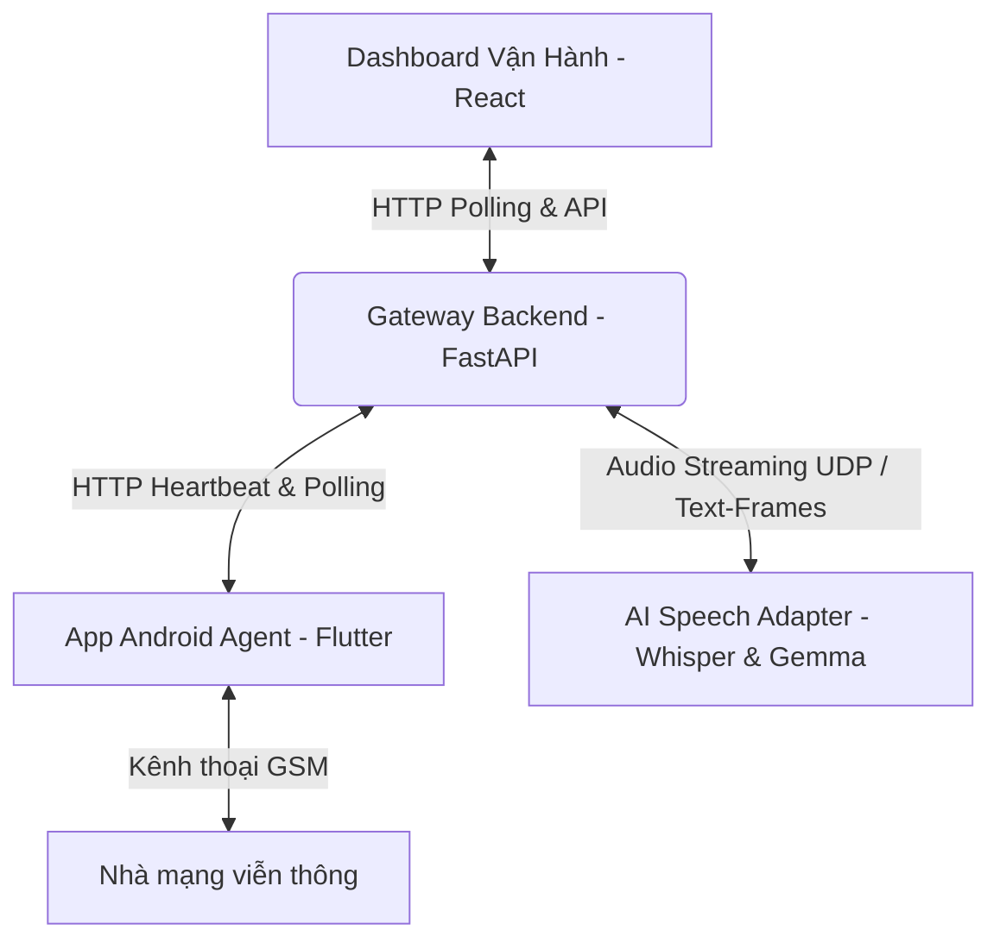

# TÀI LIỆU BÀN GIAO VÀ HƯỚNG DẪN TRIỂN KHAI BOXPHONE GATEWAY & ANDROID AGENT

Tài liệu này cung cấp hướng dẫn chi tiết dành cho kỹ thuật viên và khách hàng để cài đặt, cấu hình, kết nối mạng và vận hành hệ thống **Boxphone Gateway** cùng ứng dụng **Android Agent** (chạy trên Samsung S9 / Xiaomi).

---

## MỤC LỤC
1. [Tổng Quan Kiến Trúc Hệ Thống](#1-tổng-quan-kiến-trúc-hệ-thống)
2. [Yêu Cầu Phần Cứng & Môi Trường](#2-yêu-cầu-phần-cứng--môi-trường)
3. [Cài Đặt Gateway Backend (Máy Tính / Server)](#3-cài-đặt-gateway-backend-máy-tính--server)
4. [Cài Đặt & Chạy Dashboard Vận Hành (Frontend)](#4-cài-đặt--chạy-dashboard-vận-hành-frontend)
5. [Cài Đặt & Cấu Hình Trên Điện Thoại (Android Agent)](#5-cài-đặt--cấu-hình-trên-điện-thoại-android-agent)
6. [Các Phương Án Kết Nối Mạng (Chi Tiết)](#6-các-phương-án-kết-nối-mạng-chi-tiết)
   - [Phương án A: Kết nối qua mạng Wi-Fi chung (Dễ nhất để test)](#phương-án-a-kết-nối-qua-mạng-wi-fi-chung-dễ-nhất-để-test)
   - [Phương án B: Kết nối trực tiếp PC <-> Điện thoại qua dây LAN (IP Tĩnh)](#phương-án-b-kết-nối-trực-tiếp-pc---điện-thoại-qua-dây-lan-ip-tĩnh)
   - [Phương án C: Kết nối mạng dây LAN thông qua cục phát Wi-Fi (DHCP Tự động)](#phương-án-c-kết-nối-mạng-dây-lan-thông-qua-cục-phát-wi-fi-dhcp-tự-động)
   - [Phương án D: Kết nối trực tiếp qua cáp sạc USB (USB Tethering)](#phương-án-d-kết-nối-trực-tiếp-qua-cáp-sạc-usb-usb-tethering)
   - [Phương án E: Kết nối từ xa qua Internet (Tailscale VPN)](#phương-án-e-kết-nối-từ-xa-qua-internet-tailscale-vpn)
7. [Tích Hợp Hệ Thống AI (Whisper & Gemma-2)](#7-tích-hợp-hệ-thống-ai-whisper--gemma-2)
8. [Hướng Dẫn Gọi Thử Nghiệm (Dial Test)](#8-hướng-dẫn-gọi-thử-nghiệm-dial-test)
9. [Bảng Tra Cứu Lỗi Thường Gặp (Troubleshooting)](#9-bảng-tra-cứu-lỗi-thường-gặp-troubleshooting)

---

## 1. TỔNG QUAN KIẾN TRÚC HỆ THỐNG

Hệ thống kết nối thiết bị Android vật lý (đóng vai trò Boxphone) vào hệ thống telesales tự động dựa trên AI:



* **Gateway Backend (FastAPI)**: Quản lý thiết bị đăng ký, giám sát trạng thái kết nối, điều phối hàng đợi lệnh (Dial, Hangup), nhận luồng âm thanh PCM từ điện thoại và gửi âm thanh phản hồi từ AI ngược lại điện thoại.
* **Dashboard (React)**: Giao diện web trực quan giúp theo dõi tình trạng thiết bị (pin, nhiệt độ, cường độ sóng), danh sách cuộc gọi, lịch sử lệnh và đo lường lưu lượng gói tin âm thanh thời gian thực.
* **Android Agent (Flutter)**: Ứng dụng chạy ngầm (Foreground Service) trên điện thoại để nhận lệnh từ Gateway, thực hiện quay số vật lý, và thiết lập luồng âm thanh UDP hai chiều.

---

## 2. YÊU CẦU PHẦN CỨNG & MÔI TRƯỜNG

* **Máy tính / Server chạy Gateway**:
  * Windows 10/11 hoặc Linux.
  * Đã cài đặt **Python 3.10+** và **Node.js 18+**.
  * Chạy AI cục bộ (Gemma-2 + Whisper): Khuyến nghị GPU **NVIDIA RTX 3060 / 4060 / 5070 trở lên (VRAM >= 8GB - 12GB)**.
* **Điện thoại**:
  * Các thiết bị chạy Android 9.0+ (Khuyến nghị Samsung S9/S9+ hoặc Xiaomi đã được cấu hình quyền chạy ngầm).
  * Cáp chuyển đổi **USB-C sang LAN (Ethernet adapter)** (nếu dùng kết nối dây mạng).
  * Cáp sạc USB chất lượng tốt (nếu kết nối qua USB Tethering).

---

## 3. CÀI ĐẶT GATEWAY BACKEND (MÁY TÍNH / SERVER)

### Bước 1: Cài đặt thư viện Python phụ thuộc
Mở PowerShell tại thư mục dự án và chạy:
```powershell
.\.python312\python.exe -m pip install -r backend\requirements.txt
```
*(Hoặc dùng lệnh `pip install -r backend\requirements.txt` tùy thuộc vào môi trường Python đã cấu hình).*

### Bước 2: Khởi chạy Gateway Backend
Hệ thống sử dụng cổng HTTP `8080` (tránh cổng `8000` mặc định thường bị Windows chiếm dụng) và dải cổng UDP âm thanh từ `35001 -> 35005`:
```powershell
python -m uvicorn main:app --app-dir backend --host 0.0.0.0 --port 8080
```
Khi chạy thành công, màn hình sẽ thông báo:
`INFO: Uvicorn running on http://0.0.0.0:8080 (Press CTRL+C to quit)`

---

## 4. CÀI ĐẶT & CHẠY DASHBOARD VẬN HÀNH (FRONTEND)

Mở một cửa sổ PowerShell mới (giữ nguyên cửa sổ chạy backend ở trên):

### Bước 1: Di chuyển vào thư mục dự án
```powershell
cd C:\Users\Admin\Desktop\tool-telesales
```

### Bước 2: Cài đặt thư viện frontend
```powershell
npm install
```

### Bước 3: Khởi chạy giao diện
```powershell
npm run dev
```
Mở trình duyệt Web (Chrome/Cốc Cốc) truy cập địa chỉ hiển thị trên màn hình (thường là `http://localhost:5173/`). Nhấp vào menu **Cấu hình Hệ thống (Gateway)** để theo dõi trạng thái.

---

## 5. CÀI ĐẶT & CẤU HÌNH TRÊN ĐIỆN THOẠI (ANDROID AGENT)

### Bước 1: Cài đặt ứng dụng
* Sử dụng file cài đặt **`app-release.apk`** ở thư mục gốc của dự án.
* Sao chép file này vào điện thoại và thực hiện cài đặt. 
* *Lưu ý trên Xiaomi/Samsung*: Nếu hệ thống cảnh báo ứng dụng chưa được xác minh, nhấn **"Vẫn cài đặt" (Install anyway)**.

### Bước 2: Thiết lập quyền chạy ngầm (Rất quan trọng trên Xiaomi)
Để tránh hệ thống Android tự động tắt ứng dụng khi tắt màn hình:
1. Nhấn giữ biểu tượng app **Android Agent** ngoài màn hình -> chọn **Thông tin ứng dụng (App Info)**.
2. **Quyền ứng dụng (Permissions)**: Bật đầy đủ quyền **Microphone (Ghi âm)** và **Phone (Điện thoại)**.
3. **Quyền khác (Other Permissions) / Quản lý quyền**: Bật quyền **Hiển thị cửa sổ pop-up khi chạy ngầm (Display pop-up windows while running in the background)**.
4. **Tiết kiệm pin (Battery saver)**: Đổi từ *Mặc định (Smart)* sang **Không hạn chế (No restrictions)**.

---

## 6. CÁC PHƯƠNG ÁN KẾT NỐI MẠNG (CHI TIẾT)

Tùy thuộc vào hạ tầng mạng thực tế tại văn phòng của khách hàng, lựa chọn 1 trong các phương án kết nối dưới đây để điện thoại thông suốt với máy tính chạy Gateway:

### PHƯƠNG ÁN A: Kết nối qua mạng Wi-Fi chung (Dễ nhất để test)
* **Nguyên lý**: Máy tính kết nối Wi-Fi, điện thoại kết nối chung Wi-Fi đó.
1. Trên máy tính, chạy lệnh `ipconfig` xem IP của card Wi-Fi (ví dụ: `192.168.0.110`).
2. Trên điện thoại, mở app Android Agent, nhập Gateway URL:
   `http://192.168.0.110:8080/api/v1`
3. Nhập Device ID: `S9_01`, nhấn **Save and Start Agent**.

---

### PHƯƠNG ÁN B: Kết nối trực tiếp PC <-> Điện thoại qua dây LAN (IP Tĩnh)
* **Nguyên lý**: Dùng dây LAN cắm trực tiếp từ adapter S9/Xiaomi vào cổng LAN của PC (không qua router). Bắt buộc phải cài IP tĩnh thủ công.

#### 1. Cấu hình trên máy tính (PC):
1. Mở **Network Connections** trên Windows (Control Panel -> Network and Sharing Center -> Change adapter settings).
2. Click đúp chuột vào biểu tượng card mạng dây **Ethernet**.
3. Chọn **Properties** -> click đúp vào **Internet Protocol Version 4 (TCP/IPv4)**.
4. Tích chọn **Use the following IP address** và điền:
   * **IP address**: `192.168.99.1`
   * **Subnet mask**: `255.255.255.0`
5. Nhấn **OK** để lưu lại.

#### 2. Cấu hình trên điện thoại (S9 / Xiaomi):
1. Vào **Cài đặt (Settings) -> Kết nối -> Cài đặt kết nối khác -> Ethernet -> Cấu hình thiết bị Ethernet** (hoặc tìm kiếm từ khóa `Ethernet` trong phần cài đặt).
2. Chọn **Tĩnh (Static IP)** và điền:
   * **Địa chỉ IP (IP Address)**: `192.168.99.2`
   * **Cổng phụ (Gateway)**: `192.168.99.1`
   * **Mặt nạ mạng / Độ dài tiền tố**: Nhập `255.255.255.0` (hoặc nhập số `24` nếu là Xiaomi).
   * **DNS 1**: Nhập `8.8.8.8` *(bắt buộc để hiện nút Lưu)*.
3. Nhấn **Lưu (Save)**.
4. Mở app Android Agent, nhập Gateway URL: `http://192.168.99.1:8080/api/v1` rồi ấn **Save and Start**.

---

### PHƯƠNG ÁN C: Kết nối mạng dây LAN thông qua cục phát Wi-Fi (DHCP Tự động)
* **Nguyên lý**: Máy tính kết nối Wi-Fi (hoặc cắm LAN vào cục Wi-Fi). Điện thoại cắm LAN vào cục Wi-Fi này. Cục Wi-Fi sẽ tự cấp phát IP tự động.

1. Bật Ethernet trên điện thoại sang chế độ tự động **DHCP**. Chuyển card mạng PC về chế độ nhận IP tự động.
2. Cắm dây LAN của điện thoại vào **Cổng LAN** phía sau cục phát Wi-Fi.
3. Trên PC, chạy lệnh `ipconfig` xem IP nhận được (ví dụ: `192.168.0.118`).
4. Trên điện thoại, mở app Android Agent, nhập Gateway URL:
   `http://192.168.0.118:8080/api/v1`
5. Nhấn **Save and Start**.

---

### PHƯƠNG ÁN D: Kết nối trực tiếp qua cáp sạc USB (USB Tethering)
* **Nguyên lý**: Sử dụng dây cáp sạc thông thường nối điện thoại và PC. Hệ thống giả lập card mạng dây tốc độ cao qua USB.

1. Cắm cáp sạc kết nối điện thoại vào cổng USB của PC.
2. Trên điện thoại, vào **Cài đặt -> Kết nối & chia sẻ -> bật Chia sẻ kết nối internet qua USB (USB tethering)**.
3. Trên PC, gõ `ipconfig` tìm IP mới xuất hiện (ví dụ: `192.168.42.129`).
4. Trên điện thoại, mở app Android Agent, nhập Gateway URL tương ứng:
   `http://192.168.42.129:8080/api/v1`
5. Nhấn **Save and Start**.

---

### PHƯƠNG ÁN E: Kết nối từ xa qua Internet (Tailscale VPN)
* **Nguyên lý**: Phù hợp khi điện thoại ở xa (dùng 4G/5G) kết nối về PC chạy Gateway tại văn phòng.

1. Tải app **Tailscale** trên máy tính và trên điện thoại, đăng nhập **chung một tài khoản**.
2. Kích hoạt trạng thái Connected trên cả hai thiết bị.
3. Xem IP Tailscale của máy tính PC hiển thị trên app (ví dụ: `100.112.199.85`).
4. Trên app điện thoại, nhập Gateway URL:
   `http://100.112.199.85:8080/api/v1`
5. Nhấn **Save and Start**.

---

## 7. TÍCH HỢP HỆ THỐNG AI (WHISPER & GEMMA-2)

Khi khởi động, Gateway sẽ cố gắng tải mô hình chuyển đổi giọng nói (STT) Whisper và mô hình ngôn ngữ (LLM) Gemma-2 của Google. Để kích hoạt thành công quyền tải mô hình từ HuggingFace:

### Bước 1: Đồng ý điều khoản của Google (Chỉ làm 1 lần)
1. Đăng ký/Đăng nhập tài khoản trên [huggingface.co](https://huggingface.co/).
2. Truy cập vào trang mô hình: [https://huggingface.co/google/gemma-2-2b-it](https://huggingface.co/google/gemma-2-2b-it).
3. Nhấp chọn đồng ý điều khoản dịch vụ **"Accept terms and access repository"**.

### Bước 2: Tạo Access Token
1. Vào **Settings -> Access Tokens** trên tài khoản Hugging Face của bạn.
2. Nhấp **Create new token**, chọn phân quyền là **Read**, sao chép mã Token (bắt đầu bằng `hf_...`).

### Bước 3: Đưa Token vào môi trường và khởi chạy
Trong PowerShell trước khi chạy server uvicorn:
```powershell
$env:HF_TOKEN="MÃ_TOKEN_CỦA_BẠN_Ở_BƯỚC_2"
python -m uvicorn main:app --app-dir backend --host 0.0.0.0 --port 8080
```
*Lần đầu chạy, hệ thống sẽ tự động tải mô hình (Whisper ~70MB và Gemma ~5GB) mất khoảng vài phút. Từ các lần sau, mô hình sẽ tải trực tiếp từ ổ cứng trong 5 giây.*

---

## 8. HƯỚNG DẪN GỌI THỬ NGHIỆM (DIAL TEST)

Sau khi trạng thái thiết bị trên điện thoại báo **Online (Idle)** và xuất hiện trên Dashboard Web, bạn có thể ra lệnh cho điện thoại thực hiện cuộc gọi bằng cách:

Mở một cửa sổ PowerShell mới trên PC và chạy lệnh gửi yêu cầu quay số:

```powershell
Invoke-RestMethod -Method Post `
  -Uri "http://localhost:8080/api/v1/calls/dial" `
  -ContentType "application/json" `
  -Body '{"phone_number":"SỐ_ĐIỆN_THOẠI_CỦA_BẠN"}'
```
*(Thay `SỐ_ĐIỆN_THOẠI_CỦA_BẠN` bằng số thực tế để kiểm tra)*. Điện thoại sẽ tự động thực hiện quay số ra ngoài.

---

## 9. BẢNG TRA CỨU LỖI THƯỜNG GẶP (TROUBLESHOOTING)

| Lỗi / Hiện tượng | Nguyên nhân phổ biến | Cách khắc phục |
| --- | --- | --- |
| **Không bấm được nút Lưu IP Tĩnh trên S9/Xiaomi** | Thiếu thông số DNS hoặc cấu hình sai định dạng | Điền đầy đủ tất cả các ô, đặc biệt ô DNS 1 nhập `8.8.8.8` thì nút Lưu mới hiện lên. |
| **Mục Ethernet bị ẩn / xám không cho bật** | Điện thoại chưa nhận diện được Adapter chuyển đổi USB-C to LAN | Rút ra cắm lại chặt hơn, lật ngược đầu cáp USB-C, hoặc cắm thêm sạc vào cổng sạc phụ trên Adapter để cấp điện cho chip mạng. |
| **Báo lỗi WinError 10013 khi chạy Uvicorn** | Cổng HTTP (8000) hoặc dải cổng UDP âm thanh bị chiếm hoặc khóa bởi Hyper-V/Docker | Chạy Backend trên cổng khác (Ví dụ cổng `8080` như hướng dẫn ở mục 3). |
| **Thiết bị không xuất hiện trên Dashboard (Offline)** | Điền sai địa chỉ IP máy tính hoặc Firewall chặn cổng | Đảm bảo điện thoại chung mạng LAN với PC. Tạm thời tắt Windows Firewall hoặc tạo Rule mở cổng `8080` trên máy tính. |
| **Lỗi tải Gemma: Access to model restricted** | Chưa đồng ý điều khoản hoặc chưa cấu hình Token Hugging Face | Thực hiện lại các bước tạo và cấu hình `$env:HF_TOKEN` ở mục 7. |
| **Cuộc gọi bị tự ngắt / Mất kết nối khi tắt màn hình** | Hệ thống Android tối ưu pin và ngắt tác vụ chạy ngầm | Thiết lập cấu hình app Android Agent: Không hạn chế tiết kiệm pin và cho phép hiển thị cửa sổ pop-up chạy ngầm. |
