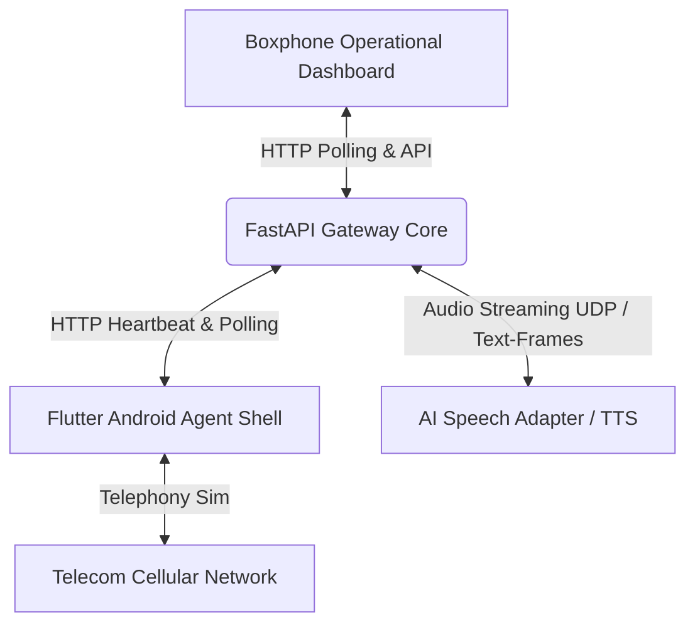

# Boxphone Hardware Gateway & Android Agent User Manual

This manual provides comprehensive instructions for deploying, configuring, and operating the Boxphone Hardware Gateway system and its accompanying Android agent shell.

---

## System Architecture Overview

The Boxphone Integration System connects physical Android devices (acting as Boxphones) to an AI-driven automated sales workspace.



### Components

1. **Gateway Core Backend (FastAPI)**: Manages device registration, monitors active call sessions, handles remote CLI and websocket commands, and records real-time audio metrics.
2. **Operational Dashboard Frontend (React / Vite / TypeScript)**: Provides an operations room for hardware health, active gateway queues, sent command history logs, and network packets tracking.
3. **Android Agent Shell (Flutter)**: Stands as the device-level background control unit, handling device telemetry heartbeats, polling remote command buffers, and managing telephony event loops.

---

## Getting Started

### 1. Backend Gateway Deployment

#### Prerequisites
- Python 3.10+
- Installed dependencies in virtualenv: `pip install -r backend/requirements.txt`

#### Running the Server
Launch the gateway server using Uvicorn:
```bash
cd backend
uvicorn main:app --host 0.0.0.0 --port 8000 --reload
```
The gateway API will be hosted at `http://localhost:8000/api/v1`.

---

### 2. Frontend Operations Dashboard

#### Prerequisites
- Node.js 18+
- Dependencies installed: `npm install`

#### Running the Dashboard
Start the development server:
```bash
npm run dev
```
Navigate to `http://localhost:5173/` and select **Cấu hình Hệ thống (Gateway)** from the menu. Use the **Boxphone Operational Dashboard** sub-tab to monitor active devices and calls.

---

### 3. Flutter Android Agent Shell

#### Prerequisites
- Flutter SDK (3.10+)
- Android Emulator or physical device with USB debugging enabled.

#### Running the Agent Shell
Run the app on a connected device:
```bash
cd android_agent
flutter run
```

---

## Configuration & Testing Workflows

### Wirelessly Connecting the Agent to the Gateway
1. Open the Android Agent Shell app.
2. In the **Gateway Connection Settings** panel, configure the connection params:
   - **Gateway Base API URL**: Use `http://10.0.2.2:8000/api/v1` for local emulator testing, or the local IP address (e.g., `http://192.168.1.15:8000/api/v1`) of the host machine running the gateway backend.
   - **Device Identifier (ID)**: A unique ID (e.g., `S9_AGENT_01`).
   - **Audio Port**: Specify a UDP port (e.g., `28000`).
   - **SIM Slot**: Choose a slot index (1 to 4).
3. Tap **START** to establish a polling heartbeat loop.

### Simulating Telephony Events & Command Plane
1. Navigate to the **Boxphone Operational Dashboard** in the React web panel. You will see the connected device listed under **Registered Devices** with its telemetry stats updated in real-time.
2. Trigger call events to see command flows:
   - **Dial Command**: Initiate a dial command from the dashboard (e.g., dialing a customer number).
   - **Heartbeat updates**: Modify sliders inside the agent app for **Battery Level**, **Temperature**, or **Charging status** to see metrics update live in the web panel.
   - **Audio Flow Tracking**: During an active call, check the **Audio Streaming Metrics** panel on the web interface to monitor packet throughput, latency, and drops.

---

## Troubleshooting

- **Device not showing up in dashboard**: Ensure the agent can access the gateway base URL. Run `curl http://YOUR_GATEWAY_IP:8000/api/v1/gateway/devices` from your network to verify access.
- **Port Binding conflicts**: If testing with multiple simulated devices, make sure each device is assigned a unique `Audio Port`.
- **Database / Registry clear**: Restarting the backend service resets the device registry and active sessions. Simply tap **START** again on the agent shell to re-register.
